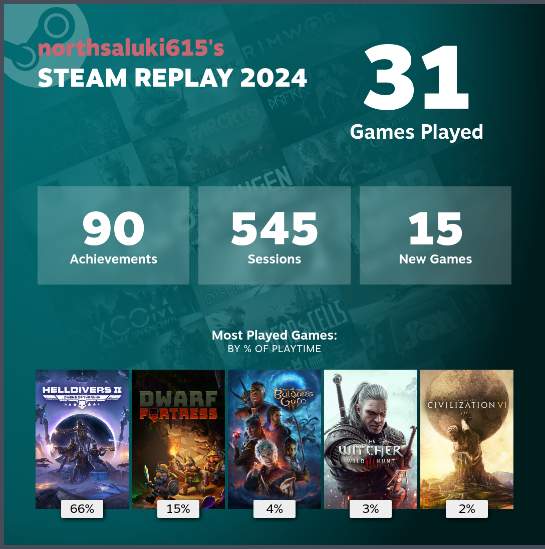

## Best of 2024

Here's my personal "best of" for 2024. While not everything below came out this year, it is media I consumed, and left an impact.

### Movies and TV Shows

Here's my listing of my "Best of 2024" for movies and TV shows. All can be viewed at [Letterboxd](https://letterboxd.com/b00ksc0ut/list/best-of-2024/).

| **Title**                                | **Poster**                                                                                                             |
|------------------------------------------|-------------------------------------------------------------------------------------------------------------------------|
| [**Dune: Part Two (2024)**](https://letterboxd.com/film/dune-part-two/)      |  |
| [**Furiosa: A Mad Max Saga (2024)**](https://letterboxd.com/film/furiosa/)  |  |
| [**Civil War (2024)**](https://letterboxd.com/film/civil-war-2024/)         |          |
| [**Deadpool & Wolverine (2024)**](https://letterboxd.com/film/deadpool-3/) |  |
| [**Alien: Romulus (2024)**](https://letterboxd.com/film/alien-romulus/)    |  |

### Video Games

[My year in Steam](https://s.team/y24/gffcqjn?l=english)

I want to give a special shoutout to Helldivers 2. What a game. I'm what's called a "Daddiver". I have a kid, work, and friends. I only have so much time to game, and this masterpiece lets me pop on for 30 minutes, spread some freedom, and get back to what I was doing. Helldivers provided a lot of good distractions this year. So, if you want to play, let me know. Let's spread some managed democracy, and free the galaxy from tyranny.

### Music

The songs and albums of my year.

#### JPEG RAW

[https://open.spotify.com/album/09XurHGqbBgvj7SH96UbPV?si=9ZxWYkwzTYyn84_PK-O_8A](https://open.spotify.com/album/09XurHGqbBgvj7SH96UbPV?si=9ZxWYkwzTYyn84_PK-O_8A)

#### Neon Pill

[https://open.spotify.com/album/2dGlEut1TyhAyApZ0ADIsd?si=io5OweWGTJ6L219u87RaWg](https://open.spotify.com/album/2dGlEut1TyhAyApZ0ADIsd?si=io5OweWGTJ6L219u87RaWg)

#### AJR

[https://open.spotify.com/artist/6s22t5Y3prQHyaHWUN1R1C?si=5iozgrdLSxuWIvm_Dsk-Sg](https://open.spotify.com/artist/6s22t5Y3prQHyaHWUN1R1C?si=5iozgrdLSxuWIvm_Dsk-Sg)

### Books

This was the year I finally finished The Expanse series. Here are the final three books in the series.

I've been reading these over the last few years. I'm glad I finally finished them. This is some of the best science fiction I've read in a long time. The final three books take palce 20 years after the events of the previous books, and it takes some interesting turns. There is an otherworldly element that permeates the final books. I felt that it added a horror element that I didn't expect. It's been a couple months since I finished the series, and I still think about it.

Aliens that are truly alien were introduced, and really holds a mirror to humankind. I can't reccomend this series enough.

And in the end, the only way to win is to not play the game.

  

    <a href="https://www.goodreads.com/book/show/28335696-persepolis-rising" class="book-link">Persepolis Rising</a>

  

  

    <a href="https://www.goodreads.com/book/show/28335698-tiamat-s-wrath" class="book-link">Tiamat's Wrath</a>

  

  

    <a href="https://www.goodreads.com/book/show/28335699-leviathan-falls" class="book-link">Leviathan Falls</a>

  

