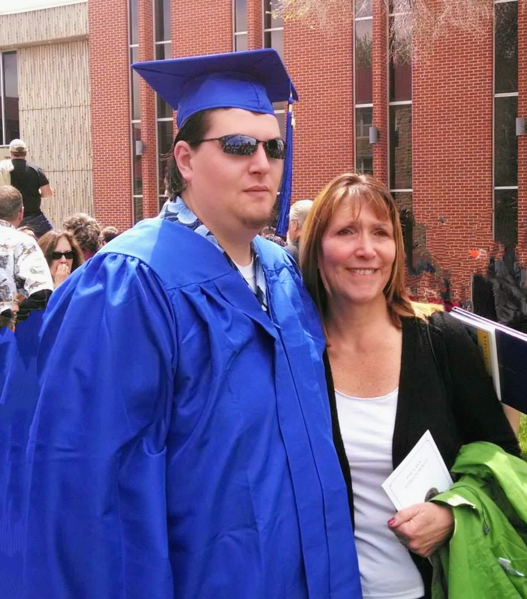

# The Helmers Boys

I'm the oldest of four boys.

My younger brothers, in oldest to youngest, are Tim, John, and Chris. Together, we're the Helmers Boys.

On June 22, 2024, Tim had a particularly bad day, and took his own life.

This was unexpected. No one saw this coming. His loss is devastating. I'm writing this nearly a month later, and I still cry daily. Over the most random things. Yesterday, it was because I looked at a map of Trinidad, CO, where Tim graduated with his Associates Degree.

I'm not really sure what I'm doing here, so I think I'm just going to talk about him.

---

# Tim's Life 

Born October 11, 1987, Tim was my first little brother. He would eventually grow to be the tallest Helmers boy, being my "big" little brother. In high school Tim was active in band (trombone player), helping out with theater behind the scenes, and Boy Scouts.

While a member of Plano Troop 71, Tim first attended summer camp at [Camp Robert Drake](https://www.campdrake.com/) in Fairmount, IL. This turned out to be an event that would define Tim for the rest of his life. Starting as a CIT (Counselor in Training), he would eventually rise to running the Dining Hall at Camp Drake. Feedings hundreds of Scouts over multiple summers. The amount of people fed was only surpassed when Tim penned the legendary 2006 Year End Report. The folklore says it's quality is still unsurpassed.

Throughout his life, he would work and numerous scout camps across the country. There really was nothing he loved more.

Joining the Coast Guard, Tim eventually made his way up to [Loran Station Port Clarence](https://www.alaskahandbook.com/places/us-coast-guard-loran-station-port-clarence/). A [LORAN](https://en.wikipedia.org/wiki/LORAN) station, north of Nome, Alaska. This was an incredibly remote location, that required a minimum of three plane hops, with the final one being a puddle jumper. I recall a story he shared of Tim's 21st birthday. Him and his Coastie buddies were hanging out and boxing (probably drunk), and Tim ended up breaking his nose. This required the Coast Guard to fly him Nome to see a doctor, who was out. So Tim ended up spending his 21st birthday at a bar in Nome, with a broken nose.

Going off stories, my family held a remembrance festival for Tim. Several former Camp Drake staff members made the event and shared their stories. Most of them involved high school kids being dumb, and ultimately getting caught because Tim stating LOUDLY, that "Guys, I'm not sure if we should do this."

# After High School

Tim spent some more Coast Guard time in Seattle, and was eventually sent to New Orleans to assist with the BP Oil-spill clean up efforts. Tim had a job running and Arms Room. He once told me that his most exciting day was when some idiot fired a single round into the ocean, and he had to complete a ton of paperwork explaining what happened.

Once out of the Coast Guard, Tim attended Trinidad State College, where he earned an Associates Degree in Gunsmithing. My parents and I were able to go out and watch him graduate. Tim even took us to a shooting range where we had the opportunity to shoot some of the guns he built.

After puttering around out west for a bit, Tim eventually made his way back to Illinois, attending George Williams College of Aurora University graduating a Bachelor's Degree in Parks and Recreation. Armed with this degree, Tim became a District Executive with the Boy Scouts of America, out in rural Idaho. Like many others, Tim lost this position during the 2020 Covid-19 Pandemic, bring him to Portland, OR.

In Portland, he had the chance to really get know his nieces, and spend his last few years with our brother Chris. Here Tim worked at a few different education places performing maintenance. Upon speaking with the people who's lives he touched there, he was remembered as a kind man, who regularly brought cookies in. He joined community building groups, and left a positive impression everyone there.

This past Christmas, in 2023, would be our last together. I will be eternally grateful to Chris for hosting that year, and my partner Alicia for coming with. This gave her and my son, James, a chance to spend some time with Tim. A chance to get to know him. He and Alicia hit it off, and one of my highlights was getting high with them and getting caught in the absurdity of a print that showed bunnies at a spa run by carrots, bathing in carrot juice. I am so happy for that memory, as Alicia and I still laugh about it.

---
# I'll Miss Him

Tim was, is, a good man. A kind man. He had a deep sense of right and wrong. He was one of the least malicious people I know. He cared deeply about his friends and family.

I'm going to miss his calls where he makes the most awkward small-talk, until he abruptly changes the topic to what he wanted to call me about. I'm going to miss figuring out life with him. I'm going to miss him.

Because this how I process things, I've built a little memorial site for him. I hope to keep it simple so I can ensure it lives forever. If you have a comment or story you would like to share, please let me know, I'll add it to the memories of his life.

[tim.helmers.me](https://tim.helmers.me)

Thank you Tim. I love you. I miss you. I will always be proud to have you as my brother.

